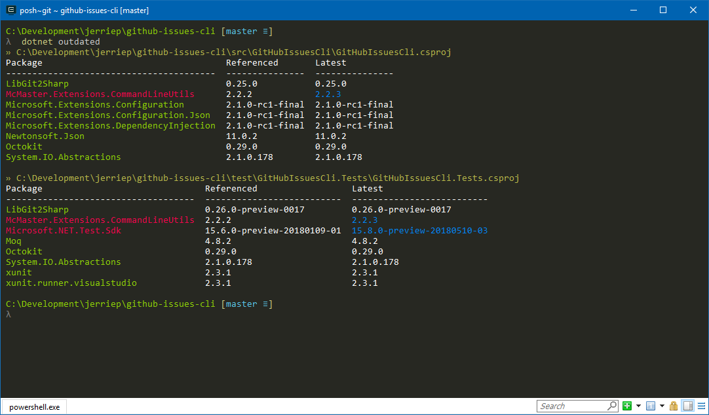
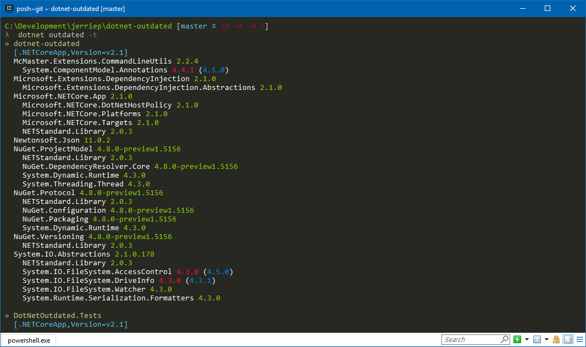

[](https://github.com/dotnet-outdated/dotnet-outdated/actions?workflow=Release)
[](LICENSE)
[](https://www.nuget.org/packages/dotnet-outdated-tool/)


# dotnet-outdated

This is a continuation of the original `dotnet-outdated` tool created by Jerrie Pelser.

If you already have the original `dotnet-outdated` tool installed you need to
run `dotnet tool uninstall --global dotnet-outdated` before installing this
version.

## Overview

When using an IDE such as Visual Studio, it is easy to find out whether newer versions of the NuGet packages used by your project is available, by using the NuGet Package Manager. However, the .NET Core command-line tools do not provide a built-in way for you to report on outdated NuGet packages.

**dotnet-outdated** is a .NET Core Global tool that allows you to quickly report on any outdated NuGet packages in your .NET Core and .NET Standard projects.

- [Installation](#installation)
- [Usage](#usage)
- [Specifying the path](#specifying-the-path)
- [Upgrading Packages](#upgrading-packages)
- [Working with secure feeds](#working-with-secure-feeds)
- [Handling pre-release versions](#handling-pre-release-versions)
- [Locking to the current major or minor release](#locking-to-the-current-major-or-minor-release)
- [Reporting on transitive dependencies](#reporting-on-transitive-dependencies)
- [Failing when updates are available](#failing-when-updates-are-available)
- [Auto-references](#auto-references)
- [Saving results to a file](#saving-results-to-a-file)
- [Including and excluding packages](#including-and-excluding-packages)
- [FAQ](#faq)

## Installation

Download and install the [.NET Core 2.1, 3.1 or 5 SDK](https://www.microsoft.com/net/download). Once installed, run the following command:

```bash
dotnet tool install --global dotnet-outdated-tool
```

If you already have a previous version of **dotnet-outdated** installed, you can upgrade to the latest version using the following command:

```bash
dotnet tool update --global dotnet-outdated-tool
```

## Usage

```text
Usage: dotnet outdated [options] <Path>

Arguments:
  Path                                       The path to a .sln, .csproj or .fsproj file, or to a directory containing a .NET Core solution/project. If none is specified, the current directory will be used.

Options:
  --version                                  Show version information
  -?|-h|--help                               Show help information
  -i|--include-auto-references               Specifies whether to include auto-referenced packages.
  -pre|--pre-release <PRERELEASE>            Specifies whether to look for pre-release versions of packages. Possible values: Auto (default), Always or Never.
  -vl|--version-lock <VERSION_LOCK>          Specifies whether the package should be locked to the current Major or Minor version. Possible values: None (default), Major or Minor.
  -t|--transitive                            Specifies whether it should detect transitive dependencies.
  -td|--transitive-depth <TRANSITIVE_DEPTH>  Defines how many levels deep transitive dependencies should be analyzed. Integer value (default = 1)
  -u|--upgrade[:<TYPE>]                      Specifies whether outdated packages should be upgraded. Possible values for <TYPE> is Auto (default) or Prompt.
  -f|--fail-on-updates                       Specifies whether it should return a non-zero exit code when updates are found.
  -inc|--include <FILTER_INCLUDE>            Specifies to only look at packages where the name contains the provided string. Culture and case insensitive. If provided multiple times, a single match is enough to include a package.
  -exc|--exclude <FILTER_EXCLUDE>            Specifies to only look at packages where the name does not contain the provided string. Culture and case insensitive. If provided multiple times, a single match is enough to exclude a package.
  -o|--output <OUTPUT_FILENAME>              Specifies the filename for a generated report. (Use the -of|--output-format option to specify the format. JSON by default.)
  -of|--output-format <OUTPUT_FILE_FORMAT>   Specifies the output format for the generated report. Possible values: json (default) or csv.
  -ot|--older-than <NUMBER_OF_DAYS>          Only include package versions that are older than the specified number of days.
```



## Specifying the path

You can run **dotnet-outdated** without specifying the `Path` argument. In this case, it will look in the current directory for a solution (`.sln`) and if one is found it will analyze that solution. If no solution is found it will look for a project (`.csproj` or `.fsproj`) and if one is found it will analyze that project. If more than one solution or project is found in the current folder, **dotnet-outdated** will report an error.

You can also pass a directory in the `Path` argument, in which case the same logic described above will be used, but in the directory specified.

Lastly, you can specify the path to a solution (`.sln`) or project (`.csproj` or `.fsproj`) which **dotnet-outdated** must analyze.

## Upgrading packages

**dotnet-outdated** can automatically attempt to upgrade any outdated packages to the latest version by passing the `-u|--upgrade` option. You can let **dotnet-outdated** prompt you for each outdated package by using the `-u:prompt` option.

## Working with secure feeds

**dotnet-outdated** supports secure NuGet feeds, such as [MyGet](https://www.myget.org). It is suggested that you add these to your sources using the [source command of the NuGet CLI](https://docs.microsoft.com/en-us/nuget/tools/cli-ref-sources). For secure feeds, you can do one of the following:

- Add a pre-authenticated URL.
- Specify the username and password for the feed using the `-UserName` and `-Password` options of the `nuget sources` command.
- Use a credential provider like [the Azure Artifacts credential provider](https://github.com/microsoft/artifacts-credprovider).

**dotnet-outdated** supports computer-level, user-level and project-level configuration files.

Using credential providers requires an environment variable `DOTNET_HOST_PATH` that is set to the path to the `dotnet` executable (e.g., `/usr/local/share/dotnet/dotnet`). Some versions of the .NET Core SDK do this for you at runtime, some do not. You will get an error message explaining this if the process finds it missing.

### Issues on macOS

In my testing, I ran into issues on macOS where the location of the user-level configuration file was not detected correctly. If you run into problems where **dotnet-outdated** does not appear to pick up your feeds correctly, please add the source to a project-level configuration file.

Also, on macOS and Linux, the password needs to be stored in clear text. You can do this by passing the `-StorePasswordInClearText` option to the `nuget sources` command.

## Handling pre-release versions

**dotnet-outdated** allows you to specify whether to use pre-release versions of packages or not by passing the `-pre|--pre-release` option.

The default value of `Auto` will determine whether to use pre-release versions of a package based on whether the referenced version itself is a pre-release version. If the referenced version is a pre-release version, **dotnet-outdated** will include newer pre-release versions of the package. If the referenced version is not a pre-release version, **dotnet-outdated** will ignore pre-release versions.

You can also tell **dotnet-outdated** to always include pre-release versions by passing the `Always` value for this option. Conversely, you can tell it to never include pre-release versions by passing the `Never` value.

## Locking to the current major or minor release

**dotnet-outdated** allows you to lock the version to the current major or minor version by passing the `-vl|--version-lock` option.

The default value of `None` will return the absolute latest package, regardless of whether it is a major or minor version upgrade.

Passing a value of `Major` will only report on later packages in the current major version range. For example, if the current version for a package is `4.1.0`, **dotnet-outdated** will only report on later packages in the `4.x` version range.

Passing a value of `Minor` will only report on later packages in the current minor version range. For example, if the current version for a package is `4.1.0`, **dotnet-outdated** will only report on later packages in the `4.1.x` version range.

## Reporting on transitive dependencies

**dotnet-outdated** supports reporting on transitive dependencies as well. These are NuGet packages on which the NuGet packages directly referenced by your application depends. To enable reporting on transitive dependencies, you can pass the `-t|--transitive` option.



You can also specify how many levels deep it should analyze transitive dependencies with the `-td|--transitive-depth` option. You can pass an integer value for this option (the default value is `1`).

**Be careful with these options!**. If you try and analyze dependencies too many levels deep, the analysis can take a very long time.

## Failing when updates are available

**dotnet-outdated** can be easily incorporated into your build process. You can optionally enable a non-zero return code when updates are found to make failing a build easy to configure. To enable this option you can pass the `-f|--fail-on-updates` option.

## Auto-references

Before version 1.2 of **dotnet-outdated**, it used to include automatically referenced packages in the output. The automatically referenced packages are typically your framework packages, such as `Microsoft.NETCore.App` or `NETStandard.Library`. It does not make sense reporting on these as outdated since you should target a new framework to have these updated.

From version 1.2, if you want these packages reported, you can pass the `-i|--include-auto-references` option. These packages will also be denoted with the text **[A]** appearing in the output after the package name.

## Saving results to a file

You can save the results of **dotnet-outdated** to a file by specifying the name of an output file using the `-o|--output` option. By default, the results will be saved in JSON format. You can specify an alternate format using the `-of|--output-format` option.

## Including and excluding packages

You can choose to include only specific packages by using the `-inc|--include` option. Only packages whose name contain the specified value will be included. For example, if you only want to analyze packages containing the value "microsoft", you can use the command `dotnet outdated --include microsoft`. This option can be passed in multiple times: each package will be evaluated against all the filters. One single match is enough to include that package.

Conversely, you can exclude specific packages by using the `-exc|--exclude` option. In this case all packages will be analyzed except packages whose name contain the specified value. For example, if you want to exclude packages containing the value "microsoft", you can use the command `dotnet outdated --exclude microsoft`. This option can be passed in multiple times: each package will be evaluated against all filters. One single match is enough to exclude that package.

Please note that for both include and exclude, the comparison is culture and case insensitive.

## Only listing new version of packages older than a specified the number of days

There are some packages that have new updates almost on daily basis, and it might slow down development and will break all CI builds if dotnet-outdated is integrated into the CI - so the development team needs to urgently react on every single update.

This command will let the developers finish their job and update the packages on their own pace.

For failing CI builds, a proposed protocol is to have another CI build which will be scheduled weekly to inform developers of new packages, and they will react accordingly.

Also, some companies/users do not feel comfortable jumping directly on the newest versions, as they might contain some bugs, and might want to wait for some time before updating to the newest package.

## Dependency Drift

One of the major characteristics of an application is the freshness of its dependencies to other libraries, APIs or environmental components that a Dependency Drift function tracks to flag the out-of-date dependencies that require updating.
Our function computes a value between 0 (no drift) and 1 (everything is outdated) and can be used in CI environments as quality metric. 

## FAQ

### Why are unrelated changes made to .csproj files when running with `-u`?

`dotnet-outdated` does not make any changes to .csproj files directly. Instead, it runs `dotnet add package` to update packages, so that command is responsible for all changes made. To track issues related to this command, head over to the [.NET CLI repo](https://github.com/dotnet/cli)

### Why I am getting an error about required library hostfxr.dll/libhostfxr.so/libhostfxr.dylib not found?

If you download the .NET Core CLI as a .zip/.tar.gz and extract it to a non default location, then you may encounter this error after installing and launching **dotnet-outdated**.

You can fix this error by setting the `DOTNET_ROOT` environment variable to point to the location of your .NET Core CLI installation. For more information, please refer to [this blog post](https://natemcmaster.com/blog/2018/05/12/dotnet-global-tools/#installing-the-net-core-cli-into-a-non-default-location).
